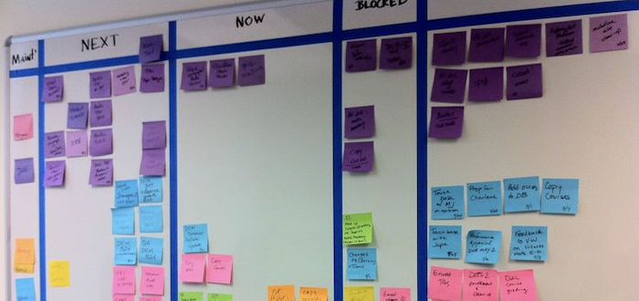

## Proces

Żeby nasza praca na rzecz partii miała sens, należy ustalić pewien proces organizujący tę pracę.

Różne osoby mają mnóstwo pomysłów na działanie, koncepcji, propozycji, projektów, współprac, które trzeba gdzieś zebrać, przeanalizować, a następnie opracować listę rzeczy do zrobienia. “Powinniśmy nawiązać współpracę z organizacją X” jest zbyt ogólne, trzeba ustalić konkretne zadania, śledzić ich postęp i wiedzieć, na którym etapie realizacji danego “pomysłu” jesteśmy. Dzięki temu będziemy w stanie realizować nawet największe i najbardziej szalone pomysły.

**Ten dokument ma na celu opisanie proponowanego procesu.**

## Kanban

###### (za: https://pl.wikipedia.org/wiki/Kanban)

Kanban to japońska metoda sterowania procesami produkcyjnymi. Na początku jej istnienia, do przedstawiania stanu produkcji w danym momencie używano tablicy korkowej, z wyznaczonymi kolumnami opisującymi etapy procesu produkcyjnego, do której przyczepiano karteczki z wyznaczonymi zadaniami. Jeśli zadanie przeszło dany etap, karteczka przesuwana była do kolejnej kolumny.

Z czasem coraz więcej firm, również pozaprodukcyjnych, zaadaptowało tę metodę do organizacji pracy swoich pracowników, a aktualnie jest jedną z popularniejszych metod zarządzania pracą między innymi w firmach IT. 

## Taiga

Taiga to wygodna aplikacja do zarządzania zadaniami. Jeśli korzystałaś/eś kiedyś z narzędzi takich jak Trello/Jira/Redmine/ClickUp, to wiele jej aspektów będzie Ci znanych - ale jeśli nie, to nie ma problemu - używanie tego narzędzia jest bajecznie proste.

## Kolumny

Każda kolumna oznacza status zadania. W naszym przypadku, są to następujące statusy:

* **new** (nowe) - świeżo utworzone zadania mają domyślnie taki status. Zadanie nie było jeszcze dyskutowane, być może nie jest kompletne, może nawet nie jest w pełni określone;
* **ready** (przygotowane) - zadanie zostało opracowane, wiadomo dokładnie, co trzeba zrobić, wszystkie potrzebne informacje do wykonania tego zadania są zebrane w jego opisie, zostało ono skomentowane przez osoby zainteresowane lub kompetentne w temacie;
* **blocked** (zablokowane) - zadanie jest zablokowane, jeśli w trakcie przygotowania okazało się, że nie można go wykonać, dopóki inne zadanie nie zostanie wykonane. Np. nie możemy poprosić prof. Gwiazdowskiego o opinię na temat naszego projektu ustawy o podatku PIT, jeśli najpierw tego projektu nie stworzymy ;
* **in progress** (w toku) - tutaj znajdują się zadania, które osoba/osoby przypisane do zadania wykonują w tym momencie. O przypisywaniu zadań do osób będzie w dalszej części dokumentu
* **done** (gotowe) - zadanie zostało wykonane. Jeśli gotowe zadanie blokowało jakieś inne zadanie, to można tamte zablokowane zadania przesunąć z kolumny **blocked** do kolumny **ready** - dzięki temu będzie wiadomo, nad czym można kontynuować prace
* **archived** (zarchiwizowane) - specjalna kolumna, do której trafiają zadania z kolumny **ready**, których już nie potrzebujemy pilnie śledzić. W razie potrzeby, zawsze można je odszukać w celu przypomnienia sobie szczegółów lub uniknięcia duplikowania pracy.

## Zadania

Aby dodać nowe zadanie, należy kliknąć przycisk + umieszczony obok nazwy kolumny New. Otworzy się wtedy nowe okno, w którym możemy wpisać tytuł zadania (Subject) oraz jego treść. Oprócz tego, do zadania można ustawić tagi, dodać załączniki (np. pliki PDF lub obrazki), czy w końcu przypisać osobę do zadania. Następnie wystarczy kliknąć przycisk "Create" (Utwórz) i zadanie pojawi się na samym dole kolumny.

Przypisywanie zadań jest ważnym elementem procesu. Przypisana osoba bierze odpowiedzialność za jego wykonanie, aktualizowanie stanu zadania, czy dodawanie do zadania komentarzy informujących o nowych okolicznościach czy zmianach w zadaniu. Jeśli zadanie jest skomplikowane lub wymaga współpracy wielu osób, można je przypisać do więcej niż jednej osoby.

Zadanie można również "zaobserwować" (Watchers) - dzięki temu każda zmiana w zadaniu, np. dodanie załącznika, tagu, komentarza, zmiana przypisanej osoby, spowoduje wysłanie maila do wszystkich obserwujących. Dzięki temu można być natychmiastowo poinformowanym o wszelkich krytyczny zadaniach, nie będąc osobą przypisaną. 

## Sekcje

Sekcje pozwalają na podzielenie zadań ze wzgędu na ich charakter. Aktualnie istnieją dwie sekcje: propozycje oraz zatwierdzone. Do propozycji powinny trafiać wszystkie nowe zadania, które nie zostały opracowane, kwestie sporne, pytania, pomysły. Po ich przejrzeniu, opracowaniu i ustaleniu kierunku działania, można przesunąć takie zadania do sekcji zatwierdzone, i tym samym rozpocząć ich realizację.

Nic nie stoi jednak na przeszkodzie, żeby stworzyć więcej sekcji, np. sekcję dedykowaną marketingowi, programowi, współpracom czy stanowiskom. Jest to kwestia wypracowania najlepszego dla nas podejścia.

## Epiki

Epiki pozwalają grupować wiele zadań pod jednym "parasolem". Kilka zadań może być częścią większego projektu, nawet jeśli są one na różnym etapie wykonania, są wykonywane przez różne osoby z różnych zespołów, czy nawet są w różnych sekcjach. Dzięki epikom można szybko sprawdzić, jaki jest postęp danego projektu, przeglądając listę tylko tych zadań, które są z nim bezpośrednio związane. 

## Wiki

TBD